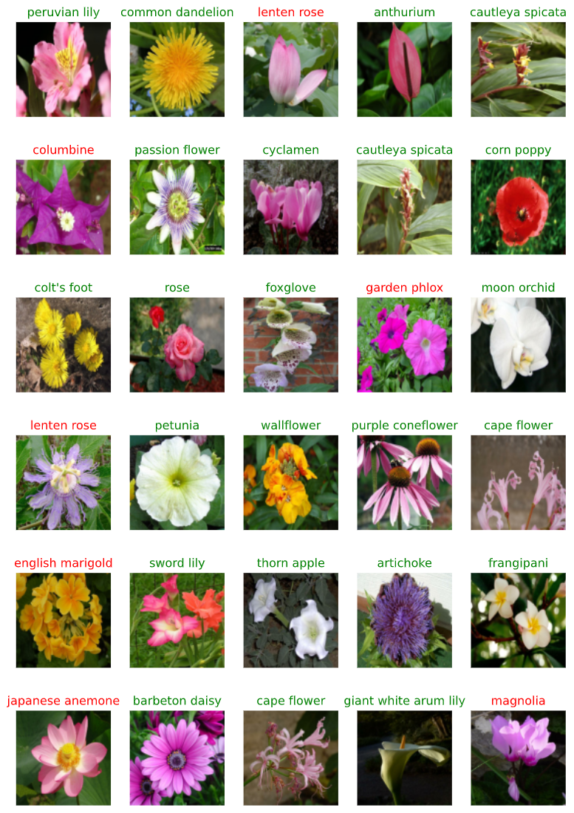

# Project overview: Deep learning with TensorFlow
Project: Finding Donors for CharityML. The project is part of Udacity 'Introducton to Machine Learning with Tensorflow' excersises. 

In this project, an image classifier, built with TensorFlow, is trained to recognize different species of flowers. First the classifier is trained using the [MobileNet](https://arxiv.org/abs/1801.04381) pre-trained image classifier network. The trained model is exported and the model is converted into a commandline Python application recognizing flower image. 


### Data

The project uses the dataset [this dataset](http://www.robots.ox.ac.uk/~vgg/data/flowers/102/index.html) from Oxford of 102 flower categories.A few examples below. 


### Code and files

- `Image_classifier.ipynb` Jypter notebook file with the main code and analysis (inc. training of the model) 
- `predict.py` Python commandline script to label a flower image provided as parameter
- `labelmap.json`  .json file containing the mapping of the image integer label codes into flower names
- `assets/` folder containing sample images
- `test_images/' folder containing test images
- `flower_classifier_model_1590939931.h5` Keras model trained to recognize flower images (HDF5 formatted file)

### Install

This project requires **Python 3.x** and the following Python libraries installed:

- [NumPy](http://www.numpy.org/)
- [matplotlib](http://matplotlib.org/)
- [tensorflow](https://www.tensorflow.org/)
- [tensorflow_hub](https://www.tensorflow.org/)
- [tensorflow_datasets](https://www.tensorflow.org/)
- [PIL] (http://www.pythonware.com/products/pil/)

You will also need to have Juypyter software installed to run and execute an [iPython Notebook](http://ipython.org/notebook.html)

### Run

In a terminal or command window run the following commands:

```bash
ipython notebook Image_classifier.ipynb
```  

The commandline program:
```bash
python predict  [-h] [--top_k TOPKCLASSES]
                [--category_names CATEGORYFILE_PATH]
                image_path savedmodel_path 
```  
Input:
      - TOPKCLASSES; Number of classes algortihm provider the probabilty estimate
      - CATEGORYFILE_PATH;  path to .json file containing the mapping of the image integer label codes into flower names
      - image_path; path to the image to be classified
      - savedmode_path; path to the flower image classifier Keras model (HDF5 formatted file) 


### Examples:

Examples of the classifer outputs (green name implying correct classification, red false classifiction)



Examples of the commandline script `predict.py` output:
```bash
 python .\predict.py --top_k 5 --category_names .\label_map.json .\test_images\cautleya_spicata.jpg .\flower_classifier_model_1590939931.h5
Loaded image file:  test_images\cautleya_spicata.jpg
Loaded Keras model file:  flower_classifier_model_1590939931.h5
Loaded category file: label_map.json

Most probable flower class for the image test_images\cautleya_spicata.jpg (top 5 classes):
Image class: 38         class category name: siam tulip          probability: 0.003
Image class: 10         class category name: snapdragon          probability: 0.004
Image class: 60         class category name: cautleya spicata    probability: 0.948
Image class: 45         class category name: wallflower          probability: 0.013
Image class: 23         class category name: red ginger          probability: 0.011
```


